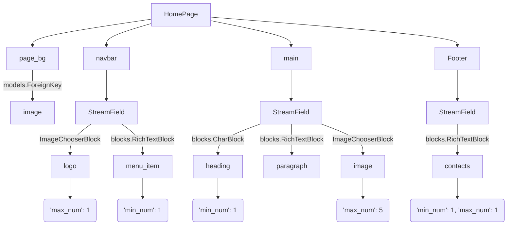

```mermaid
flowchart TD;
    A[HomePage] --> page_bg -- models.ForeignKey --> I1[image];
    A --> navbar --> S1[StreamField] -- ImageChooserBlock --> logo --> V1("'max_num': 1");
    S1 -- blocks.RichTextBlock --> Ni[menu_item] --> V2("'min_num': 1");
    A --> main --> S2[StreamField]-- blocks.CharBlock --> heading --> V3("'min_num': 1");
    S2 -- blocks.RichTextBlock --> paragraph;
    S2 -- ImageChooserBlock --> I2[image] --> V4("'max_num': 5");
    A --> Footer --> S3[StreamField] -- blocks.RichTextBlock --> contacts --> V5('min_num': 1, 'max_num': 1)
```
