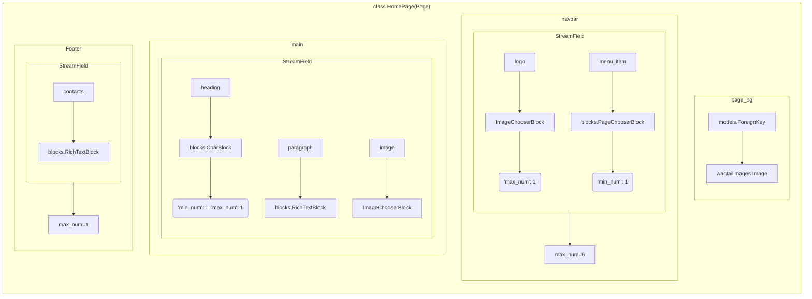

```mermaid
flowchart TD

    subgraph A["class HomePage(Page)"]
        direction TB
        subgraph page_bg
            direction TB
            models.ForeignKey --> W["wagtailimages.Image"];
            end
        subgraph navbar
            direction TB
            subgraph S1[StreamField]
            direction TB
                logo --> IC1[ImageChooserBlock] --> V1("'max_num': 1");
                menu_item --> blocks.PageChooserBlock --> V2("'min_num': 1");
                end
            S1 --> MN1["max_num=6"];
            end
        subgraph main
            direction TB
            subgraph S2[StreamField]
                direction TB
                heading --> blocks.CharBlock --> V3("'min_num': 1, 'max_num': 1");
                paragraph --> RT1[blocks.RichTextBlock];
                I2[image] --> IC2[ImageChooserBlock];
                end
            end
        subgraph Footer
            direction TB
            subgraph S3[StreamField]
                direction TB
                contacts --> RT2[blocks.RichTextBlock];
                end
            S3 --> MN2["max_num=1"];
            end
        end
```
